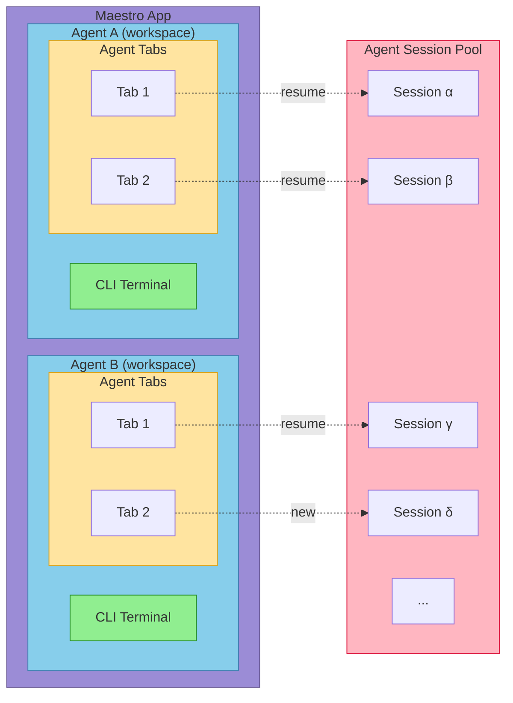

# Architecture Guide

Deep technical documentation for Maestro's architecture and design patterns. For quick reference, see [CLAUDE.md](CLAUDE.md). For development setup, see [CONTRIBUTING.md](CONTRIBUTING.md).

## Table of Contents

- [Dual-Process Architecture](#dual-process-architecture)
- [IPC Security Model](#ipc-security-model)
- [Process Manager](#process-manager)
- [Layer Stack System](#layer-stack-system)
- [Custom Hooks](#custom-hooks)
- [Services Layer](#services-layer)
- [Slash Commands System](#slash-commands-system)
- [Theme System](#theme-system)
- [Settings Persistence](#settings-persistence)
- [Claude Sessions API](#claude-sessions-api)
- [Auto Run System](#auto-run-system)
- [Error Handling Patterns](#error-handling-patterns)

---

## Architecture

Maestro organizes work into **Projects** (workspaces), each with a **CLI Terminal** and multiple **Agent Tabs**. Each tab can be connected to an **Agent Session** - either newly created or resumed from the session pool.



## Dual-Process Architecture

Maestro uses Electron's main/renderer split with strict context isolation.

### Main Process (`src/main/`)

Node.js backend with full system access:

| File | Purpose |
|------|---------|
| `index.ts` | App entry, IPC handlers, window management |
| `process-manager.ts` | PTY and child process spawning |
| `web-server.ts` | Fastify HTTP/WebSocket server for mobile remote control |
| `agent-detector.ts` | Auto-detect CLI tools via PATH |
| `preload.ts` | Secure IPC bridge via contextBridge |
| `utils/execFile.ts` | Safe command execution utility |
| `utils/logger.ts` | System logging with levels |
| `utils/shellDetector.ts` | Detect available shells |
| `utils/terminalFilter.ts` | Strip terminal control sequences |

### Renderer Process (`src/renderer/`)

React frontend with no direct Node.js access:

| Directory | Purpose |
|-----------|---------|
| `components/` | React UI components |
| `hooks/` | Custom React hooks (useSettings, useSessionManager, useFileExplorer, useBatchProcessor) |
| `services/` | IPC wrappers (git.ts, process.ts) |
| `contexts/` | React contexts (LayerStackContext) |
| `constants/` | Themes, shortcuts, modal priorities |
| `types/` | TypeScript definitions |
| `utils/` | Frontend utilities |

### Session Model

Each session runs **two processes simultaneously**:

```typescript
interface Session {
  id: string;                    // Unique identifier
  aiPid: number;                 // AI agent process (suffixed -ai)
  terminalPid: number;           // Terminal process (suffixed -terminal)
  inputMode: 'ai' | 'terminal';  // Which process receives input
  // ... other fields
}
```

This enables seamless switching between AI and terminal modes without process restarts.

---

## IPC Security Model

All renderer-to-main communication uses the preload script:

- **Context isolation**: Enabled (renderer has no Node.js access)
- **Node integration**: Disabled (no `require()` in renderer)
- **Preload script**: Exposes minimal API via `contextBridge.exposeInMainWorld('maestro', ...)`

### The `window.maestro` API

```typescript
window.maestro = {
  settings: { get, set, getAll },
  sessions: { getAll, setAll },
  groups: { getAll, setAll },
  process: { spawn, write, interrupt, kill, resize, runCommand, onData, onExit, onSessionId, onStderr, onCommandExit, onUsage },
  git: { status, diff, isRepo, numstat },
  fs: { readDir, readFile },
  agents: { detect, get, getConfig, setConfig, getConfigValue, setConfigValue },
  claude: { listSessions, readSessionMessages, searchSessions },
  dialog: { selectFolder },
  fonts: { detect },
  shells: { detect },
  shell: { openExternal },
  devtools: { open, close, toggle },
  logger: { log, getLogs, clearLogs, setLogLevel, getLogLevel, setMaxLogBuffer, getMaxLogBuffer },
  webserver: { getUrl },
}
```

---

## Process Manager

The `ProcessManager` class (`src/main/process-manager.ts`) handles two process types:

### PTY Processes (via `node-pty`)

Used for terminal sessions with full shell emulation:
- `toolType: 'terminal'`
- Supports resize, ANSI escape codes, interactive shell
- Spawned with shell (zsh, bash, fish, etc.)

### Child Processes (via `child_process.spawn`)

Used for AI assistants:
- All non-terminal tool types
- Direct stdin/stdout/stderr capture
- **Security**: Uses `spawn()` with `shell: false`

### Batch Mode (Claude Code)

Claude Code runs in batch mode with `--print --output-format json`:
- Prompt passed as CLI argument
- Process exits after response
- JSON response parsed for result and usage stats

### Stream-JSON Mode (with images)

When images are attached:
- Uses `--input-format stream-json --output-format stream-json`
- Message sent via stdin as JSONL
- Supports multimodal input

### Process Events

```typescript
processManager.on('data', (sessionId, data) => { ... });
processManager.on('exit', (sessionId, code) => { ... });
processManager.on('usage', (sessionId, usageStats) => { ... });
processManager.on('session-id', (sessionId, claudeSessionId) => { ... });
processManager.on('stderr', (sessionId, data) => { ... });
processManager.on('command-exit', (sessionId, code) => { ... });
```

---

## Layer Stack System

Centralized modal/overlay management with predictable Escape key handling.

### Problem Solved

- Previously had 9+ scattered Escape handlers
- Brittle modal detection with massive boolean checks
- Inconsistent focus management

### Architecture

| File | Purpose |
|------|---------|
| `hooks/useLayerStack.ts` | Core layer management hook |
| `contexts/LayerStackContext.tsx` | Global Escape handler (capture phase) |
| `constants/modalPriorities.ts` | Priority values for all modals |
| `types/layer.ts` | Layer type definitions |

### Modal Priority Hierarchy

```typescript
const MODAL_PRIORITIES = {
  CONFIRM: 1000,           // Highest - confirmation dialogs
  RENAME_INSTANCE: 900,
  RENAME_GROUP: 850,
  CREATE_GROUP: 800,
  NEW_INSTANCE: 750,
  QUICK_ACTION: 700,       // Command palette (Cmd+K)
  AGENT_SESSIONS: 680,
  SHORTCUTS_HELP: 650,
  ABOUT: 600,
  PROCESS_MONITOR: 550,
  LOG_VIEWER: 500,
  SETTINGS: 450,
  GIT_DIFF: 200,
  LIGHTBOX: 150,
  FILE_PREVIEW: 100,
  SLASH_AUTOCOMPLETE: 50,
  FILE_TREE_FILTER: 30,    // Lowest
};
```

### Registering a Modal

```typescript
import { useLayerStack } from '../contexts/LayerStackContext';
import { MODAL_PRIORITIES } from '../constants/modalPriorities';

const { registerLayer, unregisterLayer, updateLayerHandler } = useLayerStack();
const layerIdRef = useRef<string>();

// Use ref to avoid re-registration when callback identity changes
const onCloseRef = useRef(onClose);
onCloseRef.current = onClose;

useEffect(() => {
  if (modalOpen) {
    const id = registerLayer({
      type: 'modal',
      priority: MODAL_PRIORITIES.YOUR_MODAL,
      blocksLowerLayers: true,
      capturesFocus: true,
      focusTrap: 'strict',  // 'strict' | 'lenient' | 'none'
      ariaLabel: 'Your Modal Name',
      onEscape: () => onCloseRef.current(),
    });
    layerIdRef.current = id;
    return () => unregisterLayer(id);
  }
}, [modalOpen, registerLayer, unregisterLayer]);  // onClose NOT in deps
```

### Layer Types

```typescript
type ModalLayer = {
  type: 'modal';
  priority: number;
  blocksLowerLayers: boolean;
  capturesFocus: boolean;
  focusTrap: 'strict' | 'lenient' | 'none';
  ariaLabel?: string;
  onEscape: () => void;
  onBeforeClose?: () => Promise<boolean>;
  isDirty?: boolean;
  parentModalId?: string;
};

type OverlayLayer = {
  type: 'overlay';
  priority: number;
  blocksLowerLayers: boolean;
  capturesFocus: boolean;
  focusTrap: 'strict' | 'lenient' | 'none';
  ariaLabel?: string;
  onEscape: () => void;
  allowClickOutside: boolean;
};
```

### Internal Search Layers

Components like FilePreview handle internal search in their onEscape:

```typescript
onEscape: () => {
  if (searchOpen) {
    setSearchOpen(false);  // First Escape closes search
  } else {
    closePreview();        // Second Escape closes preview
  }
}
```

---

## Custom Hooks

### useSettings (`src/renderer/hooks/useSettings.ts`)

Manages all application settings with automatic persistence.

**What it manages:**
- LLM settings (provider, model, API key)
- Agent settings (default agent)
- Shell settings (default shell)
- Font settings (family, size, custom fonts)
- UI settings (theme, enter-to-send modes, panel widths, markdown mode)
- Terminal settings (width)
- Logging settings (level, buffer size)
- Output settings (max lines)
- Keyboard shortcuts

**Current Persistent Settings:**
- `llmProvider`, `modelSlug`, `apiKey`
- `defaultAgent`, `defaultShell`
- `fontFamily`, `fontSize`, `customFonts`
- `activeThemeId`
- `enterToSendAI`, `enterToSendTerminal`
- `leftSidebarWidth`, `rightPanelWidth`
- `markdownRawMode`
- `terminalWidth`
- `logLevel`, `maxLogBuffer`
- `maxOutputLines`
- `shortcuts`

### useSessionManager (`src/renderer/hooks/useSessionManager.ts`)

Manages sessions and groups with CRUD operations.

**Key methods:**
- `createNewSession(agentId, workingDir, name)` - Creates new session with dual processes
- `deleteSession(id, showConfirmation)` - Delete with confirmation
- `toggleInputMode()` - Switch between AI and terminal mode
- `updateScratchPad(content)` - Update session scratchpad
- `createNewGroup(name, emoji, moveSession, activeSessionId)`
- Drag and drop handlers

### useFileExplorer (`src/renderer/hooks/useFileExplorer.ts`)

Manages file tree state and navigation.

**Key methods:**
- `handleFileClick(node, path, activeSession)` - Open file or external app
- `loadFileTree(dirPath, maxDepth?)` - Load directory tree
- `toggleFolder(path, activeSessionId, setSessions)` - Toggle folder expansion
- `expandAllFolders()` / `collapseAllFolders()`
- `updateSessionWorkingDirectory()` - Change session CWD

---

## Services Layer

Services provide clean wrappers around IPC calls.

### Git Service (`src/renderer/services/git.ts`)

```typescript
import { gitService } from '../services/git';

const isRepo = await gitService.isRepo(cwd);
const status = await gitService.getStatus(cwd);
// Returns: { files: [{ path: string, status: string }] }

const diff = await gitService.getDiff(cwd, ['file1.ts']);
// Returns: { diff: string }

const numstat = await gitService.getNumstat(cwd);
// Returns: { files: [{ path, additions, deletions }] }
```

### Process Service (`src/renderer/services/process.ts`)

```typescript
import { processService } from '../services/process';

await processService.spawn(sessionId, config);
await processService.write(sessionId, 'input\n');
await processService.interrupt(sessionId);  // SIGINT/Ctrl+C
await processService.kill(sessionId);
await processService.resize(sessionId, cols, rows);

const unsubscribe = processService.onData((sessionId, data) => { ... });
```

---

## Slash Commands System

Extensible command system defined in `src/renderer/slashCommands.ts`.

### Interface

```typescript
interface SlashCommand {
  command: string;           // e.g., "/clear"
  description: string;
  terminalOnly?: boolean;    // Only show in terminal mode
  execute: (context: SlashCommandContext) => void;
}

interface SlashCommandContext {
  activeSessionId: string;
  sessions: any[];
  setSessions: (sessions) => void;
  currentMode: 'ai' | 'terminal';
  setRightPanelOpen?: (open: boolean) => void;
  setActiveRightTab?: (tab: string) => void;
  setActiveFocus?: (focus: 'sidebar' | 'main' | 'right') => void;
  setSelectedFileIndex?: (index: number) => void;
  fileTreeRef?: React.RefObject<HTMLDivElement>;
}
```

### Adding Commands

Add to `slashCommands` array:

```typescript
{
  command: '/mycommand',
  description: 'Does something useful',
  terminalOnly: false,  // Optional: restrict to terminal mode
  execute: (context) => {
    const { activeSessionId, setSessions, currentMode } = context;
    // Your logic here
  }
}
```

### Current Commands

| Command | Description | Mode |
|---------|-------------|------|
| `/clear` | Clear output history for current mode | Both |
| `/jump` | Jump to CWD in file tree | Terminal only |

---

## Theme System

Themes defined in `src/renderer/constants/themes.ts`.

### Theme Structure

```typescript
interface Theme {
  id: ThemeId;
  name: string;
  mode: 'light' | 'dark' | 'vibe';
  colors: {
    bgMain: string;           // Main content background
    bgSidebar: string;        // Sidebar background
    bgActivity: string;       // Accent background
    border: string;           // Border colors
    textMain: string;         // Primary text
    textDim: string;          // Secondary text
    accent: string;           // Accent color
    accentDim: string;        // Dimmed accent
    accentText: string;       // Accent text color
    accentForeground: string; // Text ON accent backgrounds (contrast)
    success: string;          // Success state (green)
    warning: string;          // Warning state (yellow)
    error: string;            // Error state (red)
  };
}
```

### Available Themes

**Dark themes:** Dracula, Monokai, Nord, Tokyo Night, Catppuccin Mocha, Gruvbox Dark

**Light themes:** GitHub, Solarized, One Light, Gruvbox Light, Catppuccin Latte, Ayu Light

### Usage

Use inline styles for theme colors:
```typescript
style={{ color: theme.colors.textMain }}  // Correct
```

Use Tailwind for layout:
```typescript
className="flex items-center gap-2"  // Correct
```

---

## Settings Persistence

Settings stored via `electron-store`:

**Locations:**
- **macOS**: `~/Library/Application Support/maestro/`
- **Windows**: `%APPDATA%/maestro/`
- **Linux**: `~/.config/maestro/`

**Files:**
- `maestro-settings.json` - User preferences
- `maestro-sessions.json` - Session persistence
- `maestro-groups.json` - Session groups
- `maestro-agent-configs.json` - Per-agent configuration

### Adding New Settings

1. Add state in `useSettings.ts`:
```typescript
const [mySetting, setMySettingState] = useState<MyType>(defaultValue);
```

2. Create wrapper function:
```typescript
const setMySetting = (value: MyType) => {
  setMySettingState(value);
  window.maestro.settings.set('mySetting', value);
};
```

3. Load in useEffect:
```typescript
const saved = await window.maestro.settings.get('mySetting');
if (saved !== undefined) setMySettingState(saved);
```

4. Add to return object and export.

---

## Claude Sessions API

Browse and resume Claude Code sessions from `~/.claude/projects/`.

### Path Encoding

Claude Code encodes project paths by replacing `/` with `-`:
- `/Users/pedram/Projects/Maestro` → `-Users-pedram-Projects-Maestro`

### IPC Handlers

```typescript
// List sessions for a project
const sessions = await window.maestro.claude.listSessions(projectPath);
// Returns: [{ sessionId, projectPath, timestamp, modifiedAt, firstMessage, messageCount, sizeBytes }]

// Read messages with pagination
const { messages, total, hasMore } = await window.maestro.claude.readSessionMessages(
  projectPath,
  sessionId,
  { offset: 0, limit: 20 }
);

// Search sessions
const results = await window.maestro.claude.searchSessions(
  projectPath,
  'query',
  'all'  // 'title' | 'user' | 'assistant' | 'all'
);

// Get global stats across all Claude projects (with streaming updates)
const stats = await window.maestro.claude.getGlobalStats();
// Returns: { totalSessions, totalMessages, totalInputTokens, totalOutputTokens,
//            totalCacheReadTokens, totalCacheCreationTokens, totalCostUsd, totalSizeBytes }

// Subscribe to streaming updates during stats calculation
const unsubscribe = window.maestro.claude.onGlobalStatsUpdate((stats) => {
  console.log(`Progress: ${stats.totalSessions} sessions, $${stats.totalCostUsd.toFixed(2)}`);
  if (stats.isComplete) console.log('Stats calculation complete');
});
// Call unsubscribe() to stop listening
```

### UI Access

- Shortcut: `Cmd+Shift+L`
- Quick Actions: `Cmd+K` → "View Agent Sessions"
- Button in main panel header

---

## Auto Run System

File-based document runner for automating multi-step tasks. Users configure a folder of markdown documents containing checkbox tasks that are processed sequentially by AI agents.

### Component Architecture

| Component | Purpose |
|-----------|---------|
| `AutoRun.tsx` | Main panel showing current document with edit/preview modes |
| `AutoRunSetupModal.tsx` | First-time setup for selecting the Runner Docs folder |
| `AutoRunDocumentSelector.tsx` | Dropdown for switching between markdown documents |
| `BatchRunnerModal.tsx` | Configuration modal for multi-document batch execution |
| `PlaybookNameModal.tsx` | Modal for naming saved playbook configurations |
| `PlaybookDeleteConfirmModal.tsx` | Confirmation modal for playbook deletion |
| `useBatchProcessor.ts` | Hook managing batch execution logic |

### Data Types

```typescript
// Document entry in the batch run queue (supports duplicates)
interface BatchDocumentEntry {
  id: string;              // Unique ID for drag-drop and duplicates
  filename: string;        // Document filename (without .md)
  resetOnCompletion: boolean;  // Uncheck all boxes when done
  isDuplicate: boolean;    // True if this is a duplicate entry
}

// Git worktree configuration for parallel work
interface WorktreeConfig {
  enabled: boolean;              // Whether to use a worktree
  path: string;                  // Absolute path for the worktree
  branchName: string;            // Branch name to use/create
  createPROnCompletion: boolean; // Create PR when Auto Run finishes
}

// Configuration for starting a batch run
interface BatchRunConfig {
  documents: BatchDocumentEntry[];  // Ordered list of docs to run
  prompt: string;                   // Agent prompt template
  loopEnabled: boolean;             // Loop back to first doc when done
  worktree?: WorktreeConfig;        // Optional worktree configuration
}

// Runtime batch processing state
interface BatchRunState {
  isRunning: boolean;
  isStopping: boolean;
  documents: string[];           // Document filenames in order
  currentDocumentIndex: number;  // Which document we're on (0-based)
  currentDocTasksTotal: number;
  currentDocTasksCompleted: number;
  totalTasksAcrossAllDocs: number;
  completedTasksAcrossAllDocs: number;
  loopEnabled: boolean;
  loopIteration: number;         // How many times we've looped
  folderPath: string;
  worktreeActive: boolean;
  worktreePath?: string;
  worktreeBranch?: string;
}

// Saved playbook configuration
interface Playbook {
  id: string;
  name: string;
  createdAt: number;
  updatedAt: number;
  documents: PlaybookDocumentEntry[];
  loopEnabled: boolean;
  prompt: string;
  worktreeSettings?: {
    branchNameTemplate: string;
    createPROnCompletion: boolean;
  };
}
```

### Session Fields

Auto Run state is stored per-session:

```typescript
// In Session interface
autoRunFolderPath?: string;      // Persisted folder path for Runner Docs
autoRunSelectedFile?: string;     // Currently selected markdown filename
autoRunMode?: 'edit' | 'preview'; // Current editing mode
autoRunEditScrollPos?: number;    // Scroll position in edit mode
autoRunPreviewScrollPos?: number; // Scroll position in preview mode
autoRunCursorPosition?: number;   // Cursor position in edit mode
batchRunnerPrompt?: string;       // Custom batch runner prompt
batchRunnerPromptModifiedAt?: number;
```

### IPC Handlers

```typescript
// List markdown files in a directory
'autorun:listDocs': (folderPath: string) => Promise<{ success, files, error? }>

// Read a markdown document
'autorun:readDoc': (folderPath: string, filename: string) => Promise<{ success, content, error? }>

// Write a markdown document
'autorun:writeDoc': (folderPath: string, filename: string, content: string) => Promise<{ success, error? }>

// Save image to folder
'autorun:saveImage': (folderPath: string, docName: string, base64Data: string, extension: string) =>
  Promise<{ success, relativePath, error? }>

// Delete image
'autorun:deleteImage': (folderPath: string, relativePath: string) => Promise<{ success, error? }>

// List images for a document
'autorun:listImages': (folderPath: string, docName: string) => Promise<{ success, images, error? }>

// Playbook CRUD operations
'playbooks:list': (sessionId: string) => Promise<{ success, playbooks, error? }>
'playbooks:create': (sessionId: string, playbook) => Promise<{ success, playbook, error? }>
'playbooks:update': (sessionId: string, playbookId: string, updates) => Promise<{ success, playbook, error? }>
'playbooks:delete': (sessionId: string, playbookId: string) => Promise<{ success, error? }>
```

### Git Worktree Integration

When worktree is enabled, Auto Run operates in an isolated directory:

```typescript
// Check if worktree exists and get branch info
'git:worktreeInfo': (worktreePath: string) => Promise<{
  success: boolean;
  exists: boolean;
  isWorktree: boolean;
  currentBranch?: string;
  repoRoot?: string;
}>

// Create or reuse a worktree
'git:worktreeSetup': (mainRepoCwd: string, worktreePath: string, branchName: string) => Promise<{
  success: boolean;
  created: boolean;
  currentBranch: string;
  branchMismatch: boolean;
}>

// Checkout a branch in a worktree
'git:worktreeCheckout': (worktreePath: string, branchName: string, createIfMissing: boolean) => Promise<{
  success: boolean;
  hasUncommittedChanges: boolean;
}>

// Create PR from worktree branch
'git:createPR': (worktreePath: string, baseBranch: string, title: string, body: string) => Promise<{
  success: boolean;
  prUrl?: string;
}>
```

### Execution Flow

1. **Setup**: User selects Runner Docs folder via `AutoRunSetupModal`
2. **Document Selection**: Documents appear in `AutoRunDocumentSelector` dropdown
3. **Editing**: `AutoRun` component provides edit/preview modes with auto-save (5s debounce)
4. **Batch Configuration**: `BatchRunnerModal` allows ordering documents, enabling loop/reset, configuring worktree
5. **Playbooks**: Save/load configurations for repeated batch runs
6. **Execution**: `useBatchProcessor` hook processes documents sequentially
7. **Progress**: RightPanel shows document and task-level progress

### Write Queue Integration

Without worktree mode, Auto Run tasks queue through the existing execution queue:
- Auto Run tasks are marked as write operations (`readOnlyMode: false`)
- Manual write messages queue behind Auto Run (sequential)
- Read-only operations from other tabs can run in parallel

With worktree mode:
- Auto Run operates in a separate directory
- No queue conflicts with main workspace
- True parallelization enabled

---

## Error Handling Patterns

### IPC Handlers (Main Process)

**Pattern 1: Throw for critical failures**
```typescript
ipcMain.handle('process:spawn', async (_, config) => {
  if (!processManager) throw new Error('Process manager not initialized');
  return processManager.spawn(config);
});
```

**Pattern 2: Try-catch with boolean return**
```typescript
ipcMain.handle('git:isRepo', async (_, cwd) => {
  try {
    const result = await execFileNoThrow('git', ['rev-parse', '--is-inside-work-tree'], cwd);
    return result.exitCode === 0;
  } catch {
    return false;
  }
});
```

### Services (Renderer)

**Pattern: Never throw, return safe defaults**
```typescript
export const gitService = {
  async isRepo(cwd: string): Promise<boolean> {
    try {
      return await window.maestro.git.isRepo(cwd);
    } catch (error) {
      console.error('Git isRepo error:', error);
      return false;
    }
  },
};
```

### React Components

**Pattern: Try-catch with user-friendly errors**
```typescript
const handleFileLoad = async (path: string) => {
  try {
    const content = await window.maestro.fs.readFile(path);
    setFileContent(content);
  } catch (error) {
    console.error('Failed to load file:', error);
    setError('Failed to load file');
  }
};
```

### Summary

| Layer | Pattern |
|-------|---------|
| IPC Handlers | Throw critical, catch optional |
| Services | Never throw, safe defaults |
| ProcessManager | Throw spawn failures, emit runtime events |
| Components | Try-catch async, show UI errors |
| Hooks | Internal catch, expose error state |
