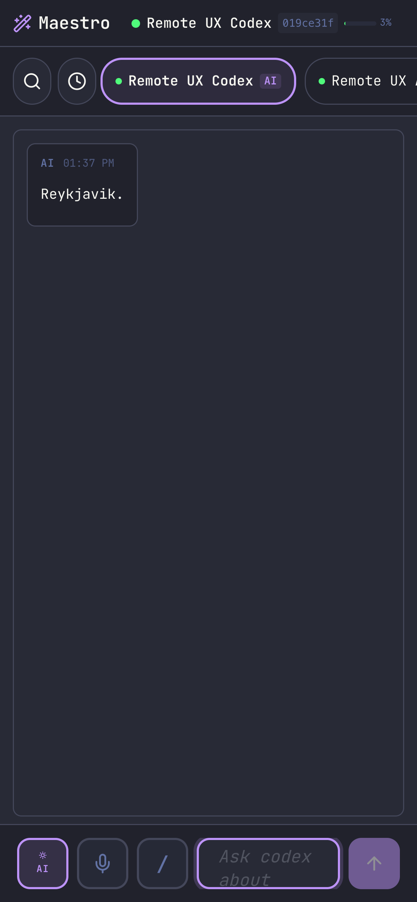
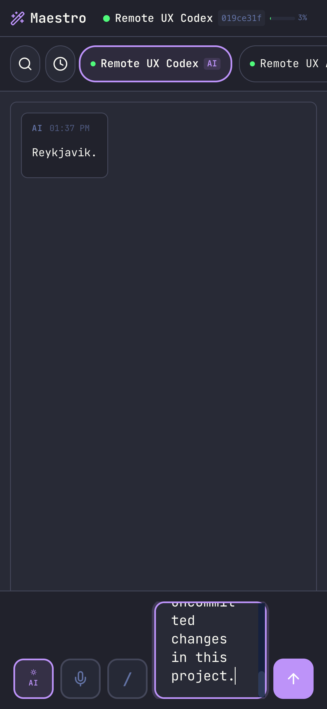
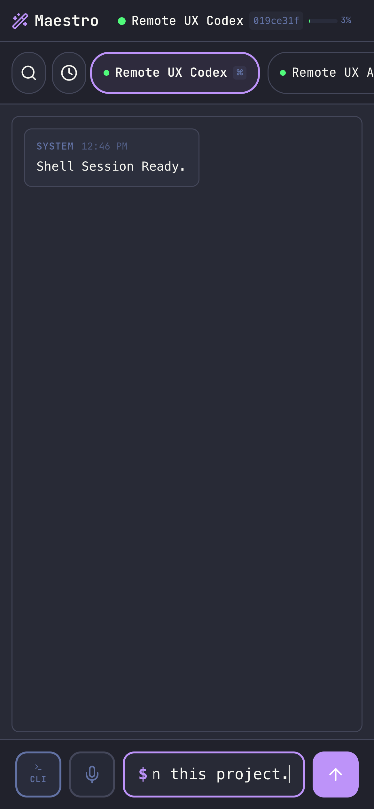
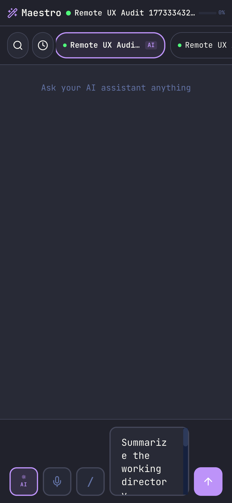

# Dogfood Report: Maestro Remote Control

| Field       | Value                                                                                                                                    |
| ----------- | ---------------------------------------------------------------------------------------------------------------------------------------- |
| **Date**    | 2026-03-12                                                                                                                               |
| **App URL** | https://decades-police-oxide-mix.trycloudflare.com/7246cb9d-3033-4643-a7c8-cee91b7ff052                                                  |
| **Session** | Remote UX Audit 1773336790326                                                                                                            |
| **Scope**   | Mobile-first audit of remote session start, AI/CLI switching, response visibility, text input ergonomics, and tablet responsive behavior |

## Summary

### Original Findings

| Severity  | Count |
| --------- | ----- |
| Critical  | 0     |
| High      | 3     |
| Medium    | 0     |
| Low       | 0     |
| **Total** | **3** |

### Current Retest Status On `7cfaded1`

| Status                                           | Count |
| ------------------------------------------------ | ----- |
| Open High Issues                                 | 1     |
| Previously Reported Issues No Longer Reproducing | 2     |
| **Open Total**                                   | **1** |

### Retest Coverage

- Phone: reproduced long-draft composer clipping; confirmed AI to CLI isolates buffers; confirmed AI draft restores after CLI to AI; confirmed session picker no longer leaks draft into another session.
- Tablet/iPad size: long draft remained readable and contained. Evidence: `screenshots/tablet-audit-long-draft-current.png`
- Wide desktop-like size: long draft remained readable and contained. Evidence: `screenshots/wide-audit-long-draft-current-2.png`

### Post-Fix Verification

| Status                           | Count |
| -------------------------------- | ----- |
| Open Issues In Retested Scope    | 0     |
| Verified Fixed Issues            | 1     |
| Verified Previously Fixed Issues | 2     |
| **Open Total After Fixes**       | **0** |

- Rebuilt the web bundle, restarted the PM2-backed Maestro app, and re-ran the LIVE overlay remote flow until `desktop-runtime.json` returned `status: "ready"` with the fresh Cloudflare tunnel.
- Phone:
  - Long draft is now readable in a full-width stacked composer. Evidence: `screenshots/phone-verify-expanded-draft-postfix.png`
  - AI to CLI switch presents a clean shell input. Evidence: `screenshots/phone-verify-cli-after-toggle-final.png`
  - CLI `pwd` output is visible in the remote UI. Evidence: `screenshots/phone-verify-cli-pwd-output-final.png`
  - CLI to AI restores the pending AI draft. Evidence: `screenshots/phone-verify-back-to-ai-restored-final.png`
  - Real AI factoid response arrived: `What is the capital of Peru?` -> `Lima`. Evidence: `screenshots/phone-verify-ai-factoid-response-final.png`
- Tablet/iPad size remained readable after the phone-only fix. Evidence: `screenshots/tablet-verify-long-draft-final.png`
- Wide desktop-like size remained readable after the phone-only fix. Evidence: `screenshots/wide-verify-long-draft-final.png`

## Issues

<!-- Copy this block for each issue found. Interactive issues need video + step-by-step screenshots. Static issues (typos, visual glitches) only need a single screenshot -- set Repro Video to N/A. -->

### ISSUE-001: Phone AI composer collapses into a clipped vertical strip for normal-length drafts

| Field                           | Value                                                                                   |
| ------------------------------- | --------------------------------------------------------------------------------------- |
| **Severity**                    | high                                                                                    |
| **Category**                    | ux                                                                                      |
| **URL**                         | https://decades-police-oxide-mix.trycloudflare.com/7246cb9d-3033-4643-a7c8-cee91b7ff052 |
| **Repro Video**                 | N/A                                                                                     |
| **Retest Status On `7cfaded1`** | still reproducible                                                                      |

**Description**

On iPhone-sized viewports, the fixed bottom AI composer becomes too narrow once the user types a realistic prompt. The text wraps inside words, the top of the field is clipped out of view, and the user can only see the bottom portion of the draft. Expected: the main input stays readable and fully contained while growing. Actual: the input collapses into a thin, partially hidden column that makes phone prompting impractical.

**Repro Steps**

1. Open the remote dashboard on an iPhone-sized viewport and select an AI session.
   

2. Type a normal multi-clause prompt into the AI composer.
   

**Current Retest Notes**

- The exact class of bug still reproduces on the current branch when the phone composer contains a realistic unsent draft. The field no longer collapses into the original razor-thin strip, but it still anchors too low and clips the visible draft so only the lower portion is readable.
- Current evidence:
  - `screenshots/phone-audit-long-draft-current.png`
  - `screenshots/phone-audit-back-to-ai-current.png`

**Post-Fix Verification**

- No longer reproducible in the working tree after switching the phone layout to a width-based stacked composer path.
- Current evidence:
  - `screenshots/phone-verify-expanded-draft-postfix.png`
  - `screenshots/phone-verify-back-to-ai-restored-final.png`

---

### ISSUE-002: Switching from AI to CLI reuses the unsent AI draft as a shell command

| Field                           | Value                                                                                   |
| ------------------------------- | --------------------------------------------------------------------------------------- |
| **Severity**                    | high                                                                                    |
| **Category**                    | functional                                                                              |
| **URL**                         | https://decades-police-oxide-mix.trycloudflare.com/7246cb9d-3033-4643-a7c8-cee91b7ff052 |
| **Repro Video**                 | N/A                                                                                     |
| **Retest Status On `7cfaded1`** | not reproducible                                                                        |

**Description**

The mobile mode toggle carries the exact unsent AI draft into terminal mode instead of isolating AI and CLI buffers. Expected: switching to CLI should present an empty shell prompt or a terminal-specific draft buffer. Actual: the prior AI prompt instantly becomes terminal input, which creates a real risk of accidentally executing natural-language text as a shell command.

**Repro Steps**

1. In AI mode, type an unsent natural-language draft.
   

2. Tap the AI/CLI mode toggle.
   

**Current Retest Notes**

- On the current branch, switching from AI to CLI presents a clean shell input instead of reusing the unsent AI draft.
- Switching back from CLI to AI restores the original AI draft for that session.
- Current evidence:
  - `screenshots/phone-audit-after-cli-switch-current.png`
  - `screenshots/phone-audit-back-to-ai-current.png`

---

### ISSUE-003: Switching sessions carries the unsent draft into the newly selected session

| Field                           | Value                                                                                   |
| ------------------------------- | --------------------------------------------------------------------------------------- |
| **Severity**                    | high                                                                                    |
| **Category**                    | functional                                                                              |
| **URL**                         | https://decades-police-oxide-mix.trycloudflare.com/7246cb9d-3033-4643-a7c8-cee91b7ff052 |
| **Repro Video**                 | N/A                                                                                     |
| **Retest Status On `7cfaded1`** | not reproducible via current session picker flow                                        |

**Description**

The mobile composer state is not scoped to the selected session. Expected: when the user switches to a different session, they should see that session's own draft state or an empty composer. Actual: the previous session's unsent draft appears unchanged in the next session, making it easy to send the wrong prompt to the wrong agent.

**Repro Steps**

1. In one AI session, type an unsent draft.
   

2. Tap another session in the session strip.
   

**Current Retest Notes**

- Using the current `All Agents` picker, switching to another session no longer carries the unsent draft into the newly selected session.
- Returning to the original session restores the original draft.
- Current evidence:
  - `screenshots/phone-audit-search-menu-current.png`
  - `screenshots/phone-audit-after-picker-switch-current.png`
  - `screenshots/phone-audit-draft-restored-after-picker-current.png`

---
